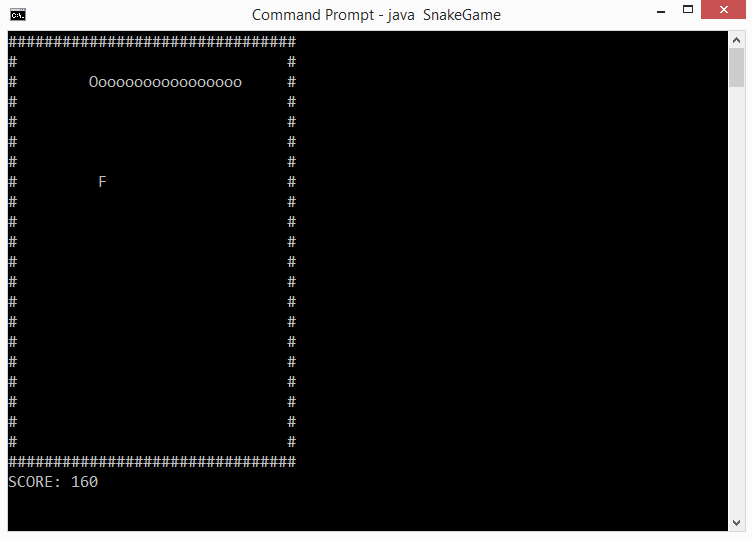

# Simple Snake Game

All the rules are pretty much similar to a typical snake game. The snake moves with [W (up), S (down), A (left), D (right)] + Enter buttons. Every time the snake eats a fruit, the total score increases by 10. Game quits on pressing X.

I used Java programming language to create this project.

Requirements: JRE

How to Run: 
1. javac snakegame.java 
2. java SnakeGame

